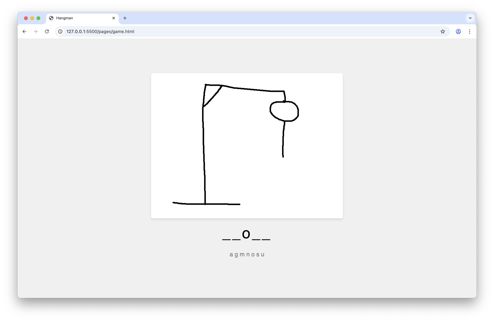
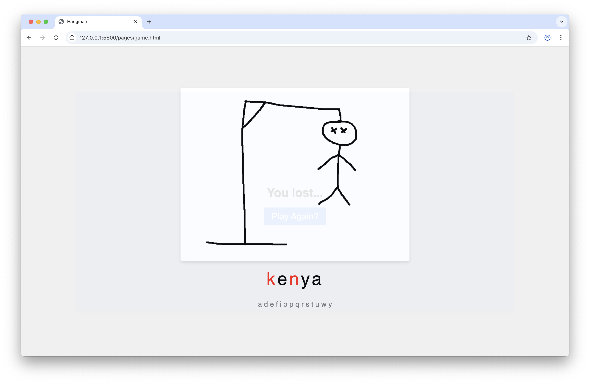
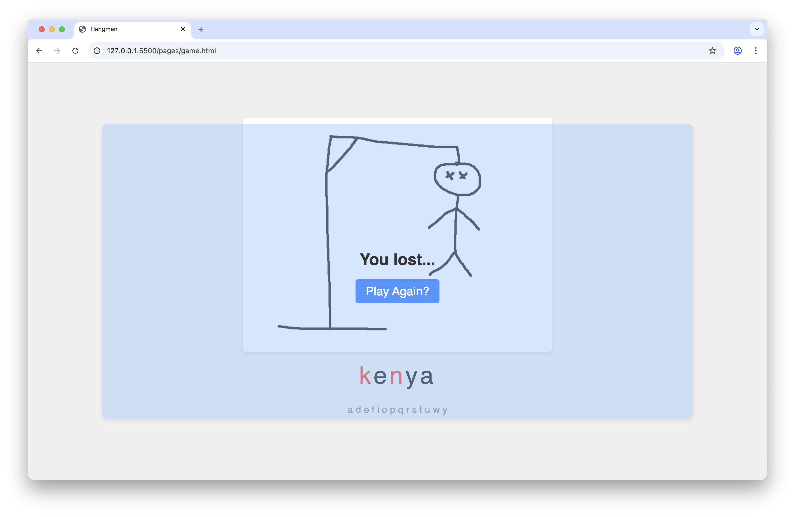
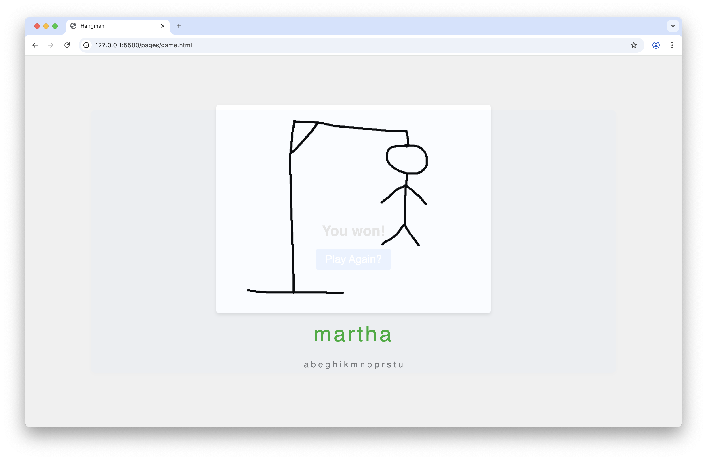
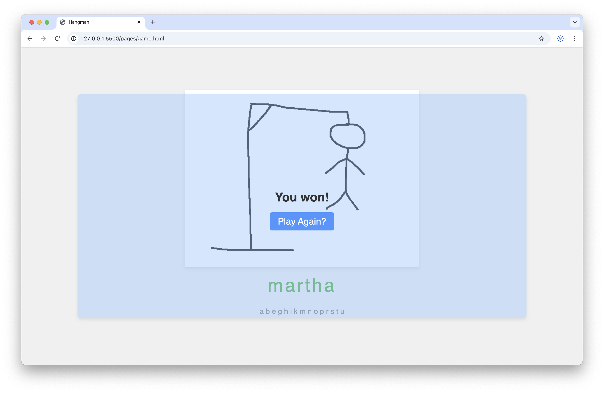

# hangman

---

A minimalistic Hangman game built with vanilla JavaScript.

All hangman illustrations were drawn by me.

The wordlist is automatically fetched from this [link](https://raw.githubusercontent.com/first20hours/google-10000-english/refs/heads/master/google-10000-english-usa-no-swears-medium.txt).

---

    
    

    
    

